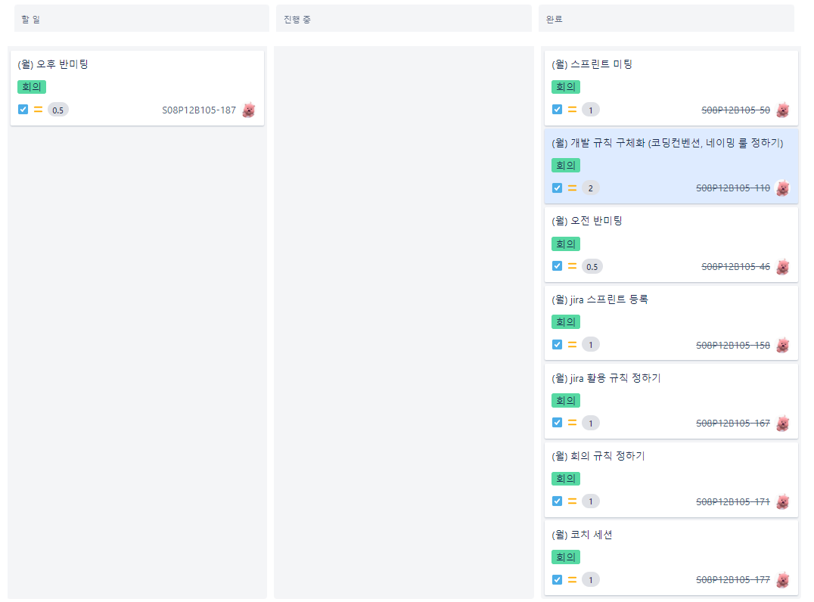
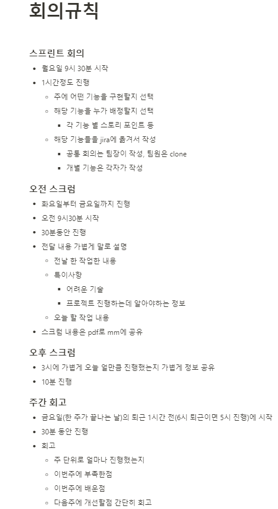
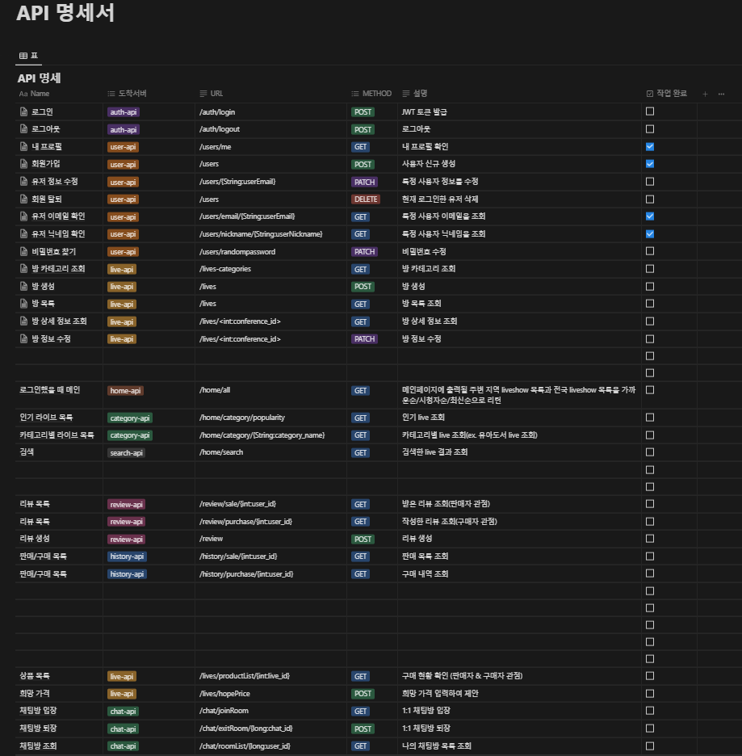

# 2023.01.16 프로젝트 업데이트

- Jira Sprint 생성

  

- Jira 활용 규칙 작성

  

- Git Commit Rule (Git Commit Message Convention) 작성

  

- Coding Convention 작성 및 개발환경 설정

  

- 회의 Rule 작성

  


# 2023.01.17 TIL. React & SpringBoot + JWT  + Security + JPA 인증

## [React]

### 1. Why ~ How

- 왜 리액트를 쓸까?
  - 리액트의 어려운 점
    - 예전 Vue 인스턴스 : html 템플릿, script, style ⇒ 다가가기 편함, 문법 자체도 html 태그 안에서 커스터마이징 가능했기에 접근성이 편했다.
    - React : 밑에 jsx문법이 들어가지만, 기본적인 바탕자체가 script 언어를 기반으로 하고 있기에, 화면 기반의 퍼블리셔, 웹 디자인의 경우 리액트는 난해했다.


### 2. CRA (react tool)

- CRA (Create React App)

  - babel, webpack

- 설치 및 시작

  - Node.js 설치 ( 최신 : 19.3.0)

  - CRA 설치

    `  npx create-react-app "project name"`

  - index.js

    - 실제로 html을 다루는 곳은 “index.js”
    - App 컴포넌트 부분에 app.js가 표현이 된다.

  - App.js

    - 변수 지정과 return
    - 리액트에서 object를 표현하는 방법인 “중괄호 {}”를 기억해라


### 3. useState ( Hook )

- 컴포넌트 내의 데이터를 다룸 ⇒ [객체, 대체값]

```
let [name, nameUpdate] = useState(["남기성", "A806"]);
```

- vue에서도 store개념으로 hook 기능을 제공하고 있음을 인지하자


### 4. component

- 리액트로 만들어진 앱을 이루는 최소한의 단위
- 컴포넌트를 쓰기 위해선 props 개념을 사용해야 한다.
  - 컴포넌트를 call하면서 props 문법을 사용해 변수값을 넘겨서 실제로 컴포넌트의 값에 적용됨을 보여줌


### 5. DataGrid

- 데이터 관리를 용이하게 할 수 있는 tool
- 컴포넌트 형태의 라이브러리를 활용
- https://mui.com/

⇒ 수많은 props를 통한 data 정렬 기능 제공


## [SpringBoot + JWT  + Security + JPA 인증]

## 1. JWT (Json Web Tokens) 란?

- JWT는 RFC 7519 웹 표준으로 지정이 되어있고, JSON 객체를 사용해서 토큰 자체에 정보들을 저장하는 Web Token

- 특히, JWT를 이용하는 방식은 다른 인증 방식들에 비해 가볍고 아주 간편하고 쉽게 적용할 수 있어서 유용한 인증방식

## 2. JWT의 구조

- JWT는 Header, Payload, Signature 로 구성

- Header
  - Signature를 해싱하기위한 알고리즘 정보
- Payload
  - 서버와 클라이언트가 주고받는 시스템에서 실제 사용될 정보에 대한 내용
- Signature
  - 토큰의 유효성 검증을 위한 문자열 (이 문자열을 통해 서버에서는 이 토큰이 유효한 토큰인지를 검증할 수 있다.)

## 3. JWT의 장/단점

### [장점]

- 중앙의 인증서버, 데이터 스토어에 대한 의존성 없음. 시스템 수평 확장 용이.

- Base64 URL Safe Encoding을 사용하기 때문에 URL, Cookie, Header 모두 사용 가능.

 

### [단점]

- Payload의 정보가 많아지만 네트워크 사용량 증가, 데이터 설계 고려 필요.

- Token이 클리이언트에 저장되기 때문에 서버에서 클라이언트의 토큰을 조작할 수 없음.


## 4. 로직 정리

-  Spring Security에 TokenProvider를 주입받은 JwtFilter를 등록

- 사용자가 사용자정보(loginId, oprrPswd) 로 인증을 요청(/authenticate) 하면 JwtFilter에서는 토큰이 있는지, 유효한지를 판단하여, 유효하다면 SpringContext에 인증정보를 저장하여 사용

- 유효하지 않다면(인증정보가 없거나 만료, 잘못된 정보일 경우) CustomUserDetailsService에서 사용자정보(loginId, oprrPswd)로 다시 확인을 하고, 유효하다면 User 정보를 조회하여 새로운 토큰정보를 생성하여 전달을 하고, 유요하지 않다면 Exception을 발생


**[Reference]**

- https://aljjabaegi.tistory.com/659
- https://www.inflearn.com/course/%EC%8A%A4%ED%94%84%EB%A7%81%EB%B6%80%ED%8A%B8-jwt/


# 2023.01.18 프로젝트 업데이트

- 기능명세서(Main)  develop

  

- 개발환경 설정 (Node.js 16.19.0, React 17)
- skeleton code 분석 및 학습


## 2023.01.19 프로젝트 업데이트

- 정기 팀미팅

- API 명세서 작성

  

- skeleton code 분석 및 학습


## 2023.01.20 프로젝트 업데이트

- Skeleton code 분석 및 학습
- 메인화면 기능 구현에 대한 학습
