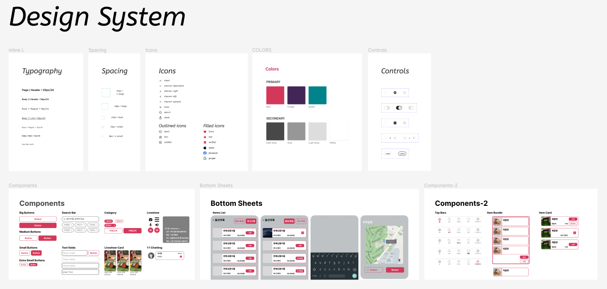
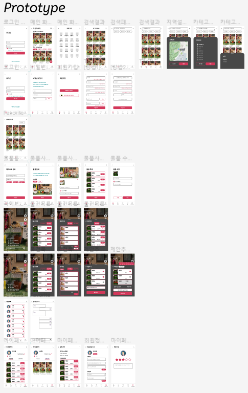

# 가지Garage

## 2023.01.16

- Sprint 회의
- Jira 규칙 정하기
- 회의 규칙 정하기
- 개발 규칙 정하기
  

## 2023.01.17

- Figma study
- 프로토타입 제작

## 2023.01.18

- Figma Design System 적용
- Prototype 제작
- 구매방식 확정
  

## 2023.01.19

- 정기 팀미팅
- Prototype 1차 완성
- React 학습시작

## 2023.01.20

- 팀역할 배분
- React 학습
- Prototype 완성
- 프론트엔드 아키텍처 설계 연습
  - Atomic design을 프론트엔드 아키텍처에 녹이는 방법 학습
    
    
