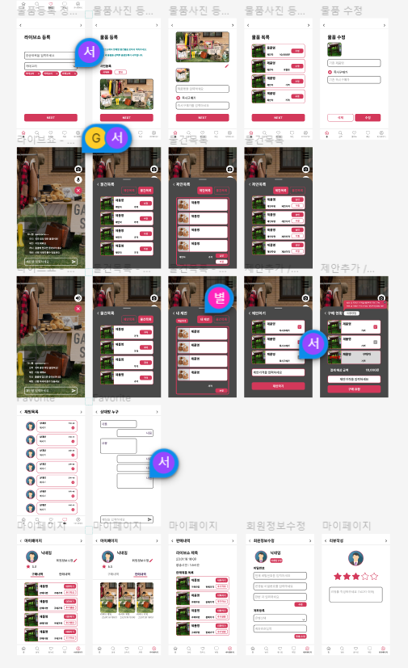

# 2023.01.16 프로젝트 업데이트

- Jira Sprint 생성

  

- Jira 활용 규칙 작성

  

- Git Commit Rule (Git Commit Message Convention) 작성

  

- Coding Convention 작성 및 개발환경 설정

  

- 회의 Rule 작성

  


# 2023.01.17 TIL. React & SpringBoot + JWT  + Security + JPA 인증

## [React]

### 1. Why ~ How

- 왜 리액트를 쓸까?
  - 리액트의 어려운 점
    - 예전 Vue 인스턴스 : html 템플릿, script, style ⇒ 다가가기 편함, 문법 자체도 html 태그 안에서 커스터마이징 가능했기에 접근성이 편했다.
    - React : 밑에 jsx문법이 들어가지만, 기본적인 바탕자체가 script 언어를 기반으로 하고 있기에, 화면 기반의 퍼블리셔, 웹 디자인의 경우 리액트는 난해했다.


### 2. CRA (react tool)

- CRA (Create React App)

  - babel, webpack

- 설치 및 시작

  - Node.js 설치 ( 최신 : 19.3.0)

  - CRA 설치

    `  npx create-react-app "project name"`

  - index.js

    - 실제로 html을 다루는 곳은 “index.js”
    - App 컴포넌트 부분에 app.js가 표현이 된다.

  - App.js

    - 변수 지정과 return
    - 리액트에서 object를 표현하는 방법인 “중괄호 {}”를 기억해라


### 3. useState ( Hook )

- 컴포넌트 내의 데이터를 다룸 ⇒ [객체, 대체값]

```
let [name, nameUpdate] = useState(["남기성", "A806"]);
```

- vue에서도 store개념으로 hook 기능을 제공하고 있음을 인지하자


### 4. component

- 리액트로 만들어진 앱을 이루는 최소한의 단위
- 컴포넌트를 쓰기 위해선 props 개념을 사용해야 한다.
  - 컴포넌트를 call하면서 props 문법을 사용해 변수값을 넘겨서 실제로 컴포넌트의 값에 적용됨을 보여줌


### 5. DataGrid

- 데이터 관리를 용이하게 할 수 있는 tool
- 컴포넌트 형태의 라이브러리를 활용
- https://mui.com/

⇒ 수많은 props를 통한 data 정렬 기능 제공


## [SpringBoot + JWT  + Security + JPA 인증]

## 1. JWT (Json Web Tokens) 란?

- JWT는 RFC 7519 웹 표준으로 지정이 되어있고, JSON 객체를 사용해서 토큰 자체에 정보들을 저장하는 Web Token

- 특히, JWT를 이용하는 방식은 다른 인증 방식들에 비해 가볍고 아주 간편하고 쉽게 적용할 수 있어서 유용한 인증방식

## 2. JWT의 구조

- JWT는 Header, Payload, Signature 로 구성

- Header
  - Signature를 해싱하기위한 알고리즘 정보
- Payload
  - 서버와 클라이언트가 주고받는 시스템에서 실제 사용될 정보에 대한 내용
- Signature
  - 토큰의 유효성 검증을 위한 문자열 (이 문자열을 통해 서버에서는 이 토큰이 유효한 토큰인지를 검증할 수 있다.)

## 3. JWT의 장/단점

### [장점]

- 중앙의 인증서버, 데이터 스토어에 대한 의존성 없음. 시스템 수평 확장 용이.

- Base64 URL Safe Encoding을 사용하기 때문에 URL, Cookie, Header 모두 사용 가능.

 

### [단점]

- Payload의 정보가 많아지만 네트워크 사용량 증가, 데이터 설계 고려 필요.

- Token이 클리이언트에 저장되기 때문에 서버에서 클라이언트의 토큰을 조작할 수 없음.


## 4. 로직 정리

-  Spring Security에 TokenProvider를 주입받은 JwtFilter를 등록

- 사용자가 사용자정보(loginId, oprrPswd) 로 인증을 요청(/authenticate) 하면 JwtFilter에서는 토큰이 있는지, 유효한지를 판단하여, 유효하다면 SpringContext에 인증정보를 저장하여 사용

- 유효하지 않다면(인증정보가 없거나 만료, 잘못된 정보일 경우) CustomUserDetailsService에서 사용자정보(loginId, oprrPswd)로 다시 확인을 하고, 유효하다면 User 정보를 조회하여 새로운 토큰정보를 생성하여 전달을 하고, 유요하지 않다면 Exception을 발생


**[Reference]**

- https://aljjabaegi.tistory.com/659
- https://www.inflearn.com/course/%EC%8A%A4%ED%94%84%EB%A7%81%EB%B6%80%ED%8A%B8-jwt/


# 2023.01.18 프로젝트 업데이트

- 기능명세서(Main)  develop

  

- 개발환경 설정 (Node.js 16.19.0, React 17)
- skeleton code 분석 및 학습


# 2023.01.19 프로젝트 업데이트

- 정기 팀미팅

- API 명세서 작성

  

- skeleton code 분석 및 학습


# 2023.01.20 프로젝트 업데이트

- Skeleton code 분석 및 학습
- 메인화면 기능 구현에 대한 학습

- 와이어프레임

  




# 2023.01.25 TIL. 스마트 홈 IoT 연동 표준 매터(Matter)

## 스마트홈

### 스마트 홈 IOT 서비스 이용 과정

제품구매 - 구매한 제품 설치 - 환경설정(앱 설치) - IOT 디바이스/서비스 간 연동


## 매터(matter)란?

2019년 Zigbee Alliance에 의해 project CHIP 시작

2021년 Zigbee Alliance는 CSA로 Project CHIP는 Matter로 명칭 변경

여러 플랫폼에서 공통으로 활용할 수 있는 통합 프로토콜


### 매터의 특징

1. 단순성 - 구매 및 사용이 간편
2. 상호 운용성 - 여러 브랜드 장치가 함께 작동
3. 신뢰서 - 일관되고 반응이 빠른 로컬 연결
4. 보안 - 강력하지만 간소화

### 메터 구조

### 스레드(Thread) 프로토콜

IEEE 802.15.4

저전력

Mesh Network - 그물망처럼 촘촘히 연결된 부분이 각각의 환경에서 동작할 수 있도록 해준다

IPv6 기반

### 메터의 구성

클라우드가 인터넷을 통해 연결되고 메터가 있는 디바이스들이 스레드라는 기술을 만나게 되면 mesh 네트워크가 서로 연결이 되어 각각의 네트워크를 구성하게 된다. 보더 라우터는 네트워크가 끊기게 되면 다른 네트워크를 찾게 된다. 또 다른 네트워크를 자동으로 찾아 IoT장치를 사용할 수 있게 된다. 다양한 장치로 연결이 가능하고 IP, 메터를 지원하지 않는 장치도 메터지원하는 허브로 모든 디바이스 연동이 가능한 구조를 가지게 된다.

### 매터에 대한 전망

2023년부터 2030년 사이에 55억개의 매터 지원 스마트홈 제품 출시 전망

향후 5년 내에 스마트홈 디바이스 제조사의 절반 이상 메터 지원 예정

### 메터 최신 동향

메터 Spec 1.0이 2022년 10월 발표되어 10여종의 디바이스 유형 지원

삼성전자의 smart things hub가 최초로 메터 인증 획득

### 최신 매터 지원 기기

삼성전자 Smart Things station 2023년 CES에서 공개

140억개의 커넥티드 기기들을 연결하기 위한 기술 비전

## 메터 참고 사이트

오픈 소스 : https://github.com/project-chip/connectedhomeip

CSA의 매터 정보: https://csa-iot.org/all-solutions/matter


# 2023.01.25 프로젝트 업데이트

- 중간발표 준비 (자료조사 및  PPT제작)


# 2023.01.26 프로젝트 업데이트

- 메인화면 API 구현
- 팀미팅(중간발표 피드백)


# 2023.01.27 TIL. [Back-End] Modern Java와 Python

### 모던 자바

함수형 프로그래밍 도입 이후 큰 변화가 있던 java8 이후

### 특징

함수형 패러다임 도입 쉬운 동시성 도입 모듈성 강화 개발자 편의 API 추가

### Java 간략한 역사

Java1 : 1996년 가급적 LTS버전을 사용하기를 권장

### Python 간략한 역사

Python 1994년

### 예제

모던자바

```
list.stream().filter(s -> s.length() >= 5 && s.length() <= 10).map(s -> s.toUpperCase()).forEach(System.out::println); 
```

파이썬

```
[s.upper() for s in str_lst if len(s) in range(5, 11)] 
```

## 함수형

- 함수를 일급 시민(first class citizen)에 포함
- 자바는 객체 지향이라 순수 함수형은 아니고 객체 지향으로 함수를 쓸 수 있게 한 것 (익명 클래스의 번거로움을 람다로 간편하게, 메서드 참조로 재사용 코드 블록을 주입(동작 파라미터화)하고 조합(pipeline)할 수 있게 됨) 
- 익명 클래스 -> 람다 -> 재사용
- 스트림의 기반
- 병렬처리와 조화

- 함수를 일급 시민에 포함 자바는 객체 지향이라 순수 함수형은 아니고 객체 지향으로 함수를 쓸 수 있게 한 것 익명 클래스 -> 람다 -> 재사용

- 주요 패키지, 클래스

  - @FunctionallInterface

  - java.util.function

  - Consumer, Supplier, Function, Predicate,...

  - Operator

  - 기본형 Int, Long, Double

## 함수형 - 람다, 메서드 참조

- 람다(lambda) = 익명 함수, 익명 클래스를 대체

- 함수형 인터페이스(이름 있는 람다) : 하나의 추상 메서드를 가진 인터페이스 

- 메서드 참조 : 메서드나 생성자를 참조하기 (::slightly_smiling_face:

- 예시 (문자열 리스트를 길이에 따라 정렬)

```java
Collections.sort(words, new Comparator<String>() {    public int compare(String o1, String o2) {        return Integer.compare(o1.length(), o2.length()); }); 
```

```java
Collections.sort(words, (o1, o2) -> Integer.compare(o1.length(), o2.length())); 
```

```java
Collections.sort(words, Comparator.comparingInt(String::length)); 
```

```java
words.sort(Comparator.comparingInt(String::length)); 
```

## 스트림

- 컬렉션 + 함수형, 데이터 처리 연산을 지원하도록 소스에서 추출된 연속된 요소

  - 외부 순환(for, while,...) VS 내부 순환(VM아 이것 좀 해줘...)

  - SQL처럼 선언형 스타일로 데이터를 처리

  - 쉽게 병렬처리 적용: parallelStream 메서드

- 주요 패키지, 클래스, 메서드

  - java.util.stream

  - BaseStream, Stream

  - map(), filter(), reduce(), min() ...

  - C.stream(), C.parallelStream()

## 스트림 - 주요 개념

```
                                Predicate   Function       Collector/consumer
```

collection -> stream —-> filter —-> map ——---> collect ——-—————-> Collection

```
                  ——————————————————| close
```

### 중간 연산과 최종 연산

- 중간 연산은 스트림을 반환, 여러 연산을 조합할 수 있음
- 최종 연산을 스트림을 모두 소비하고 닫음
- 스트림은 1회용(최종 연산 이후 **사용불가**)

### 스트림 예제

직원 리스트 → 부서별 직원 리스트

```java
Map<Department, List<Employee>> byDept = employees.stream().collect(Collectors.groupingBy(Employee::getDepartment));
```

직원 리스트 → 부서별 급여 합계

```java
Map<Department, Integer> totalByDept = employees.stream().collect(Collectors.groupingBy(Employee::getDepartment, Collectors.summingInt(Employee::getSalary)));
```

좋은 직원, 안 좋은 직원 나누기

```java
Map<Boolean, List<Employee>> byGood = employees.stream().collect(Collectors.partitioningBy(Employee::isGood));
```

## 한편 파이썬은…

원래 함수형(v1.0, since1994)

내장 컬렉션 = 리스트, 맵(딕셔너리), 튜플, 세트,…

lambda, itertools, functools, generator

### 예제

map, filter, reduce

```python
from functools import 
reduce reduce(lambda x, y: x + y, a)
```

### 파이썬스럽다 : List Comprehension

```python
a = [1, 2, 3, 4, 5] 
b = [2, 4, 6, 8, 10] 
sum([m for m in [    
    a[i] * b[i] for i in range(0, len(a))]    
     if m % 2 == 0])
```

## 병렬/동시성 concurrent

- 저수준 병렬 처리의 어려움(Thread, Lock, synchronized)

- 안전하고 쉬운 병렬처리 방법 제공

- 많이 사용되는 패턴들을 언어 차원에서  API로 지원

- ExecutorService에서 스레드 관리

- 고수준 추상화, Thread Safety, 비동기 지원

### 주요 패키지, 클래스

- java.util.concurrent

- Executor(s), ExecutorService

- xxThreadPool, ForkJoinPool

- Future, CompletableFuture

- Runnable, Callable

## 비동기 지원 Async

- 동기 / 비동기 and 블록 / 넌블록

- 작업이 끝날 때 까지 기다리기 VS 하고있어 나중에 물어볼게

- Future: 비동기 연산 지원, 완료확인/대기/결과조회/취소

- CompletableFuture: Future 작업 연결, 순서정의 등

## 면접 다수 출제 : 동기(blocking) 비동기(non block) 싱크

### 예제… 스프링에서

상황: 하나에 3초 정도 걸리는 API 5개를 호출해야 함

문제 → 10초 이상 대기하게 되면 사용자가 도망감

- 병렬이를 모르는 개발자

```java
api.callApi(someParam); 3초 
api.callApi(someParam); 3초 
api.callApi(someParam); 3초 
api.callApi(someParam); 3초 
api.callApi(someParam); 3초 
api.callApi(someParam); 3초
```

- 병렬이를 아는 개발자

여러 API 호출을 병렬로 실행

```java
for (ApiService api : apis) {    
    apiResults.add(api.callApi(param)); 
}
for (CompletableFuture<Void> future : apiResult) {
    future.get();
}
```

```java
@Async public CompletableFuture<Void> callApi(String param) {    
    // api를 호출    return new CompletableFuture<>();
}
```

## 한편 파이썬은… multiprocessing

파이썬은 느려요..? 일부만 맞는 얘기

GIL 문제: 스레드 활용을 제한하는 요소

multiprocessing

asyncio, coroutine

future, executors, ThreadPoolExecutor...어? 앞에서 봤는데??

✓ future, executors, ThreadPoolExecutor.. 어 앞어서 봤는데?

```python
with futures.ThreadPoolExecutor(max_workers=4) as executor:
    future_list = []
    for paramm in sorted(param_list):
        future = executor.submit(single_function, paramm)
        future_list.append(future)
    results = [] 
for future in futures.as_completed(future_list):
    res = future.result()
```

### 한편 파이썬은 … asyncio

✓ Asyncio로 I/O를 효율적으로 처라하자

```python
import asyncio import aiohttp
```

```python
async def slow_api_call(client, time=3):
    url = "https://httpbin.org/delay/{time}"
    async with client get(url) as resp:
        result await resp.text()
    
    return result
```

```python
async def runner (params):
    async with aiohttp.ClientSession() as session:
        tasks = [slow_api_call(session, t) for t in params]
            resp = ""
        for future in asyncio.as_completed (tasks):
            data = await future
            resp += data
    return resp
```

## 마지막으로 오늘 못 다룬 것들

✓ Reactive (Flow API)

 ✓인터페이스에 구현을 포함

 √ 모듈화 

√ try-with resources(AutoCloseable) 

✓ Optional ✓ http client 

√ 타입 추론(var) 향상된 switch 문 

√ 컬렉션 API 개선

 √ 새로운 GC 알고리즘 

√ 날짜와 시간 API 개선

 √ Fork-Join 프레임워크 

✓ Spliterator 

√ 성능 개선 

√ 각종 데코레이터 

√ match-case (Structural Pattern Matching)

 √ 상세한 에러 메시지  

√ 안쓰는 기능들 정리(deprecated)

 ✓ Context Manager

 √ 예외 처리 강화 

√타입 안정성 강화(타입 힌트)

 ✓제너레이터 

✓ etc...

## 마지막으로…3

✓ Java Support Tools

 ✓ visualVM, jconsole

 ✓jps/jstack/jstat/jhat/jmap 

✓ jshell 

✓ flight recorder, jmx, Spring Actuator

 ✓ Python Tools 

✓ profile(cProfile), memory_profiler, vProf 

✓ snakeviz


# 2023.01.27 프로젝트 업데이트

- 메인화면 API 구현
- 중간발표


# 2023.01.30 프로젝트 업데이트

- 메인 - 카테고리 구현

# 2023.01.31 TIL. [Back-End] SpringBoot JPA

## Learning Goals

1. SpringBoot JPA가 무엇인지 알 수 있다.
2. SpringBoot JPA로 DB모델 설계를 할 수 있다.
3. SpringBoot JPA로 CRUD를 할 수 있다.

## Object-Relational Mapping

객체 관계 매핑 위키백과, 우리 모두의 백과사전 객체 관계 매핑(Object-relational mapping: ORM)은 데이터베이스와 객체 지향 프로그래밍 언어 간의 호환되지 않는 데이터를 변환하는 프로그래밍 기 법이다. 객체 지향 언어에서 사용할 수 있는 가상 객체 데이터베이스를 구축하는 방법이다. 객체 관계 매핑을 가능하게 하는 상용 또는 무료 소프트웨 어 패키지들이 있고, 경우에 따라서는 독자적으로 개발하기도한다. Javax.persistence, JPA API, Entity Manager Factory, Entity Transaction, Entity, Entity Manager, Query, Persistence

@Entity JpaRepository

꿀팁: 키값을 오토인크리먼트로 하면 키값 -1인경우가 있을까없을까 - 없다

unsigned로 하는것이 꿀팁

```java
spring.datasource.url=jdbc: h2:mem:testdb 
    
spring.jpa.generate-ddl=true
spring.jpa.hibernate.ddl-auto=create 

spring.jpa.show-sql=true 
spring.jpa.properties.hibernate.format_sql=true logging.level.org.hibernate.type.descriptor.sql.BasicBinder=trace
```

## 프로퍼티 설정

[application.properties](http://application.properties/) 또는 application.yml

```java
spring.jpa.generate-ddl=true 
spring.jpa.hibernate.ddl-auto-update 

spring.jpa.show-sql=true 
spring.jpa.properties.hibernate.format_sql=true logging.level.org.hibernate.type.descriptor.sql.BasicBinder=trace
```

```java
import lombok.ToString; 

@Entity 
@NoArgsConstructor 
@Getter 
@Setter 
@ToString 
public class Board {
    @Id
    @GeneratedValue(strategy = GenerationType.AUTO)    
    @Column(columnDefinition = "INT UNSIGNED")    
    private int uid;    
    
    @OneToMany (mapped By "boardUid")    
    private List<Reply> reply = new ArrayList<>();
    private String user;
    private LocalDateTime createdDate;
    private String ip;
    private String title;
    private String contents;
    private int how;
    
    @Builder
    public Board(String user, LocalDateTime createDate, String ip, String title, ....   
         this.user = user;
         this.createDate = createDate;
```

## Relationship Mapping

단방향?양방향?

조회테이블? 참조테이블?

```java
@OneToOne
@OneToMany
@ManyToOne
@JoinColumn
```

일대일? 일대다? 다대일? 다대다?

## 대중성

일대일(1:1) @OneToOne 

일대다(1:N) @OneToMany 

다대일(N:1) @ Many ToOne

 다대다(N:M) @Many ToMany 

일대다 != 다대일 1:N != N:1 

게시물을 조회 하고 댓글을 가져올 것인가? 댓글을 조회 하고 그것이 어떤 게시글을 가져올 것인가? →비즈니스 로직에 따라 다르다!

## 방향성

@JoinColumn

Object A → Object B

Object B → Object A

Object A ↔ Object B

이런 양방향은 JPA에서는 지양해주세요!

## 연관 관계의 주인

@OneToMany(**mappedBy**="boardFk") 

// @JoinColumn(name="boardFk") 

양방향일경우 어떤 테이블 기준으로

데이터를 삭제 하면 그것에 관련된 데이터들을 다 삭제 할 것인가?

 →FK 키 관리 주인을 설정해 준다. 

→→ '다' 쪽이 주인이다. 

→→→ @Many ToOne 은 항상 주인이다.

## SpringBoot JPA Docs


## 스프링부트 JPA docs

https://docs.spring.io/spring-data/jpa/docs/current/reference/html/#jpa.query-methods.query-creation

## Summary & Quiz

- SpringBoot JPA는 (***\***)라는 ORM 프레임워크를 사용해서 구현한다.

Hibernate     

- 기본적으로 제공되는 레파짓토리 메소드이름 중에 조회에 사용되는 메소드는 (****)로 시작되는 메소드이다.

find     

- JPA를 사용할 때 꼭 구현해 줘야 하는 두가지는 (★★★)와 레파짓토리 이다.

Entity(엔티티)   

- 연관관계를 설정할 때에는 3가지를 설정해 주어야 하는데 다중성, (***), 연관관계 주인을 설정해 주어야 한다.

방향성(단방향, 양방향)

# 2023.01.31 프로젝트 업데이트

- 메인 - 카테고리 구현 마무리
- 메인 - 검색 구현


# 2023.02.01 프로젝트 업데이트

- 메인 - 검색 구현

# 2023.02.02 프로젝트 업데이트

- 메인 - 지역 설정 구현

# 2023.02.03 프로젝트 업데이트

- 메인 - 지역 설정 구현

# 2023.02.06 프로젝트 업데이트

- React 학습
- FE 코드 분석 및 FE,BE 연동 구현

# 2023.02.07 프로젝트 업데이트

- React 학습
- FE 메인 - 검색

# 2023.02.08프로젝트 업데이트

- FE 메인 - 검색, 카테고리

# 2023.02.09 프로젝트 업데이트

- FE 메인 - 전국검색
- 데이터 생성

# 2023.02.10 프로젝트 업데이트

- 추가 데이터 생성
- CSS Animation

# 2023.02.13 프로젝트 업데이트

- 메인화면 CSS Animation 추가

# 2023.02.14 프로젝트 업데이트

- CSS Animation 마무리

# 2023.02.15 프로젝트 업데이트

- UCC 회의 및 촬영
